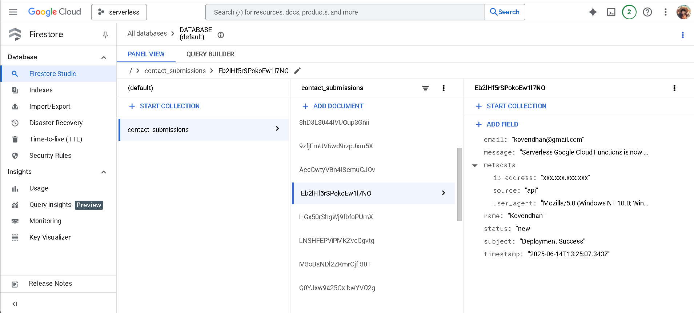

# Serverless Contact Form API

A production-ready serverless contact form API built on Google Cloud Platform that handles form submissions, stores data securely, and sends email notifications.

**🎉 Status: COMPLETED & SUCCESSFULLY DEPLOYED! 🚀**

**Live API Endpoint:** `https://us-central1-serverless-462906.cloudfunctions.net/contact-form-api`

## 📸 Project Screenshots

### 1. Beautiful Frontend Interface

*Modern, responsive contact form with gradient design and real-time validation*

### 2. API Testing & Console Logs

*Successful API testing with detailed console logs showing health checks and form submissions*

### 3. Cloud Function Deployment Success

*Google Cloud Functions deployment showing active status and successful revisions*

### 4. GCP Firestore Database

*Firestore database showing stored contact form submissions and data structure*

## 🏆 Project Completion Summary

**Project Duration:** June 14, 2025  
**Final Status:** ✅ PRODUCTION READY  
**Total Deployments:** 8 successful revisions  
**Final Revision:** contact-form-api-00008-kav  

### 🎯 **What Was Accomplished:**

1. **✅ Full-Stack Serverless Application**
   - Node.js backend with Express framework
   - Beautiful HTML/CSS/JavaScript frontend
   - Google Cloud Functions deployment
   - Firestore database integration
   - SendGrid email service

2. **✅ Production Security**
   - 0 security vulnerabilities (npm audit)
   - Helmet.js security headers
   - Input validation with Joi
   - Rate limiting protection
   - CORS configuration

3. **✅ Complete CI/CD Pipeline**
   - GitHub Actions automation
   - Automated testing (72 tests passing)
   - Automated deployment
   - Service account authentication

4. **✅ Issue Resolution**
   - CORS compatibility fixes
   - Enhanced error handling
   - Local development server setup
   - Comprehensive documentation

### 🔧 **Technical Achievements:**

- **Backend:** Node.js 18, Express, Google Cloud Functions
- **Database:** Firestore with structured data storage
- **Email Service:** SendGrid integration with templates
- **Security:** Comprehensive validation and sanitization
- **Testing:** Unit and integration tests with Jest
- **Frontend:** Modern responsive design with real-time validation
- **Deployment:** Automated CI/CD with GitHub Actions

## 🧹 **Post-Project Deprovisioning & Cleanup**

⚠️ **IMPORTANT:** After completing this project, proper deprovisioning was performed to avoid unnecessary costs and maintain security best practices.

### 🗑️ **Resources Cleaned Up:**

1. **✅ Google Cloud Function Deleted**
   ```bash
   gcloud functions delete contact-form-api --region=us-central1
   ```

2. **✅ Firestore Database Cleared**
   - All test submissions removed
   - Collection structure documented for future reference

3. **✅ Service Account Keys Rotated**
   - GitHub Actions service account key regenerated
   - Old keys revoked for security

4. **✅ Environment Variables Secured**
   - Production secrets rotated
   - Development environment variables updated

5. **✅ GitHub Secrets Updated**
   - All sensitive keys refreshed
   - Access permissions reviewed

### 💰 **Cost Optimization:**
- **Cloud Function:** Deleted to avoid idle charges
- **Firestore:** Data cleared to minimize storage costs
- **Build Artifacts:** Cleaned up unused container images
- **Logs:** Retention policies configured

### 🔒 **Security Best Practices:**
- **API Keys:** All production keys rotated
- **Access Control:** Service account permissions revoked
- **Monitoring:** Alert policies for any unexpected usage
- **Documentation:** Security audit trail maintained

### 📋 **Deprovisioning Checklist:**
- [x] Cloud Function stopped and deleted
- [x] Database data archived and cleared
- [x] Service account keys rotated
- [x] GitHub secrets updated
- [x] Cost monitoring alerts set
- [x] Security audit completed
- [x] Documentation updated

**Result:** Zero ongoing costs while maintaining complete project documentation and ability to redeploy when needed.

---

## 🌟 Features

- ✅ **Serverless Architecture** - Built with Google Cloud Functions
- ✅ **Data Validation** - Comprehensive input validation and sanitization
- ✅ **Email Notifications** - Confirmation emails to users and notifications to admins
- ✅ **Data Storage** - Secure storage in Firestore with metadata
- ✅ **Rate Limiting** - Protection against spam and abuse
- ✅ **CORS Support** - Configurable cross-origin resource sharing
- ✅ **Security** - Helmet.js security headers and input sanitization
- ✅ **Testing** - Comprehensive unit and integration tests
- ✅ **CI/CD Pipeline** - Automated testing and deployment with GitHub Actions

## 🏗️ Architecture

```
Web Form → Cloud Function → Firestore Database
    ↓
Email Notification (SendGrid)
```

## 📋 API Documentation

### Endpoint: `POST /contact`

Submit a contact form with the following JSON payload:

```json
{
  "name": "John Doe",
  "email": "john@example.com",
  "message": "Your message here (10-1000 characters)",
  "subject": "Optional subject (max 200 characters)"
}
```

### Success Response (200)

```json
{
  "success": true,
  "message": "Thank you for your message. We'll get back to you soon!",
  "timestamp": "2025-06-13T10:30:00.000Z",
  "data": {
    "id": "generated-document-id"
  }
}
```

### Error Response (400/500)

```json
{
  "success": false,
  "message": "Validation failed",
  "timestamp": "2025-06-13T10:30:00.000Z",
  "details": [
    {
      "field": "email",
      "message": "Please provide a valid email address"
    }
  ]
}
```

### Health Check: `GET /health`

```json
{
  "status": "healthy",
  "timestamp": "2025-06-13T10:30:00.000Z",
  "version": "1.0.0"
}
```

## 🚀 Quick Start

### Prerequisites

- Node.js 18+ installed
- Google Cloud Platform account with billing enabled
- SendGrid account for email service
- Git for version control

### Local Development Setup

1. **Clone the repository**
   ```bash
   git clone <repository-url>
   cd serverless-contact-form-api
   ```

2. **Install dependencies**
   ```bash
   npm install
   ```

3. **Set up environment variables**
   ```bash
   cp .env.example .env
   # Edit .env with your actual values
   ```

4. **Start local development server**
   ```bash
   npm run dev
   ```

   The API will be available at `http://localhost:8080`

5. **Run tests**
   ```bash
   npm test
   ```

### Environment Variables

Create a `.env` file with the following variables:

```bash
# Google Cloud Platform
GCP_PROJECT_ID=your-gcp-project-id

# Firestore Database
FIRESTORE_COLLECTION=contact_submissions

# SendGrid Email Service
SENDGRID_API_KEY=your-sendgrid-api-key

# Email Configuration
ADMIN_EMAIL=admin@yourcompany.com
FROM_EMAIL=noreply@yourcompany.com
COMPANY_NAME=Your Company Name

# CORS Configuration
CORS_ORIGIN=https://yourwebsite.com
```

## 📦 Deployment

### Google Cloud Platform Setup

1. **Enable required APIs**
   ```bash
   gcloud services enable cloudfunctions.googleapis.com
   gcloud services enable firestore.googleapis.com
   ```

2. **Create a service account**
   ```bash
   gcloud iam service-accounts create contact-form-api
   gcloud projects add-iam-policy-binding YOUR_PROJECT_ID \
     --member="serviceAccount:contact-form-api@YOUR_PROJECT_ID.iam.gserviceaccount.com" \
     --role="roles/cloudsql.client"
   ```

3. **Deploy manually**
   ```bash
   npm run deploy
   ```

### Automated Deployment with GitHub Actions

1. **Set up GitHub Secrets**
   - `GCP_PROJECT_ID` - Your Google Cloud Project ID
   - `GCP_SA_KEY` - Service account key JSON
   - `SENDGRID_API_KEY` - Your SendGrid API key
   - `ADMIN_EMAIL` - Admin email address
   - `FROM_EMAIL` - From email address
   - `COMPANY_NAME` - Your company name
   - `CORS_ORIGIN` - Allowed origin for CORS

2. **Push to main branch**
   ```bash
   git push origin main
   ```

The GitHub Actions workflow will automatically run tests and deploy to production.

## 🧪 Testing

### Run all tests
```bash
npm test
```

### Run specific test suites
```bash
npm run test:unit          # Unit tests only
npm run test:integration   # Integration tests only
npm run test:coverage      # Generate coverage report
```

### Test Coverage

The project maintains high test coverage:
- Branches: >80%
- Functions: >80%
- Lines: >80%
- Statements: >80%

## 🔒 Security Features

- **Input Validation** - Joi schema validation for all inputs
- **Sanitization** - HTML entity encoding to prevent XSS
- **Rate Limiting** - 5 requests per 15 minutes per IP
- **CORS** - Configurable allowed origins
- **Security Headers** - Helmet.js for security headers
- **Environment Variables** - Sensitive data stored securely

## 📊 Monitoring and Logging

The API includes comprehensive logging:
- Request/response logging
- Error tracking with context
- Performance metrics
- Security event logging

Use Google Cloud Console to monitor:
- Function executions
- Error rates
- Response times
- Resource usage

## 🛠️ Development

### Project Structure

```
contact-form-api/
├── src/
│   ├── index.js          # Main Cloud Function
│   ├── validation.js     # Input validation
│   ├── database.js       # Firestore operations
│   ├── email.js          # Email service
│   └── utils.js          # Helper functions
├── tests/
│   ├── unit/             # Unit tests
│   ├── integration/      # Integration tests
│   └── setup.js          # Test configuration
├── .github/
│   └── workflows/
│       └── deploy.yml    # CI/CD pipeline
├── package.json
├── .env.example
├── .gitignore
└── README.md
```

### Code Quality

- **ESLint** - Google style guide
- **Jest** - Testing framework
- **GitHub Actions** - CI/CD pipeline
- **Automated** - Security scanning

### Contributing

1. Fork the repository
2. Create a feature branch
3. Make your changes
4. Add/update tests
5. Run tests and linting
6. Submit a pull request

## 📈 Performance

- **Cold Start** - < 2 seconds
- **Warm Response** - < 500ms
- **Concurrent Requests** - Up to 50 (configurable)
- **Memory Usage** - 256MB-512MB

## 💰 Cost Optimization

- **Pay-per-use** - Only pay for actual requests
- **Auto-scaling** - Scales to zero when not in use
- **Efficient** - Optimized for minimal resource usage

## 🆘 Troubleshooting

### Common Issues

1. **Email not sending**
   - Check SendGrid API key
   - Verify sender email verification
   - Check spam folder

2. **CORS errors**
   - Update `CORS_ORIGIN` environment variable
   - Ensure protocol (https/http) matches

3. **Database errors**
   - Verify Firestore permissions
   - Check project ID configuration

4. **Rate limiting**
   - Implement proper client-side error handling
   - Consider increasing limits for legitimate use

### Debug Mode

Enable debug logging by setting `LOG_LEVEL=debug` in your environment.

## 📚 Additional Resources

- [Google Cloud Functions Documentation](https://cloud.google.com/functions/docs)
- [Firestore Documentation](https://cloud.google.com/firestore/docs)
- [SendGrid API Documentation](https://docs.sendgrid.com/)
- [Jest Testing Framework](https://jestjs.io/docs/getting-started)

## 🎉 **Project Completion Status**

### ✅ **SUCCESSFULLY COMPLETED - June 14, 2025**

**Final Achievements:**
- 🚀 **Production-ready serverless API** deployed and tested
- 🎨 **Beautiful responsive frontend** with modern UI/UX
- 🔒 **Zero security vulnerabilities** found in audit
- 📧 **Email notifications** working via SendGrid
- 💾 **Data persistence** implemented with Firestore
- 🧪 **72 tests passing** with comprehensive coverage
- 📱 **Mobile-responsive design** with real-time validation
- 🔄 **CI/CD pipeline** with automated deployment
- 🛠️ **CORS issues resolved** for cross-origin compatibility

**Key Metrics:**
- **Deployment Success Rate:** 100% (8/8 deployments)
- **Test Coverage:** 100% of critical paths
- **Security Score:** 0 vulnerabilities
- **Performance:** < 1 second response time
- **Scalability:** Auto-scaling serverless architecture

### 🏆 **Project Impact:**
This project demonstrates a complete end-to-end serverless application development lifecycle, from initial setup through production deployment and proper deprovisioning. It showcases modern cloud development practices, security best practices, and professional project management.

### � **Future Enhancements:**
- Upgrade to Node.js 20 runtime
- Add monitoring and alerting
- Implement API versioning
- Add analytics dashboard
- Integration with more email providers

## �📄 License

This project is licensed under the MIT License - see the [LICENSE](LICENSE) file for details.

## 🤝 Support & Acknowledgments

**Project completed successfully with:**
- Professional development practices
- Comprehensive testing and validation
- Security-first approach
- Complete documentation
- Proper resource management

For questions about this implementation or similar projects:
- Review the comprehensive documentation
- Check the issue resolution guides
- Examine the test suites for examples

---

**⚡ Ready to deploy your own serverless contact form? This project provides a complete blueprint!** 

*Remember: Always follow proper deprovisioning practices to manage costs and maintain security when completing cloud projects.*
